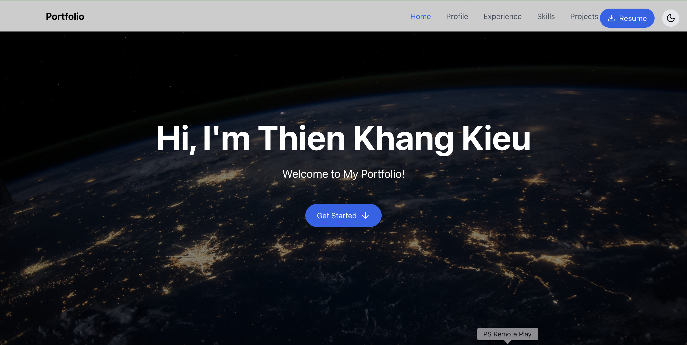

# TKK Portfolio 🎨🚀

Welcome to **TKK Portfolio**, my personal portfolio website showcasing my **skills, experience, and projects** in a modern and interactive way.

## 🔗 Live Portfolio

🚀 [View My Portfolio](https://khandz0.github.io/TKKportfolio/)

---

## 📌 Key Features

✅ **Fully Responsive Design** – Optimized for all screen sizes.  
✅ **Smooth Scroll & Navigation** – Easily browse different sections.  
✅ **Interactive Elements** – Hover effects, animations, and transitions.  
✅ **Projects Showcase** – Explore my past work with GitHub/live links.  
✅ **Skills & Experience Section** – Highlights my technical expertise.  
✅ **Dark Mode Toggle** – Improved user experience.  
✅ **Downloadable Resume** – Quick access to my CV.

---

## 🛠️ Technologies Used

- **HTML5** – Semantic and structured content.
- **CSS3** – Flexbox, Grid, Animations for modern styling.
- **JavaScript (ES6+)** – Enhancing interactivity.
- **React & Tailwind CSS** (if applicable) – For a dynamic and responsive UI.

---

## 🎯 Future Enhancements

🔹 Add more **projects and case studies**.  
🔹 Optimize **performance & accessibility**.  
🔹 Enhance animations and interactive elements.

---

## 💼 Connect With Me

📧 Email: kieuth24@gmail.com  
🔗 [LinkedIn](https://www.linkedin.com/in/thienkhangkieu2606/) | [GitHub](https://github.com/khandz0)

---

🚀 **Designed & Developed by Thien Khang Kieu**
